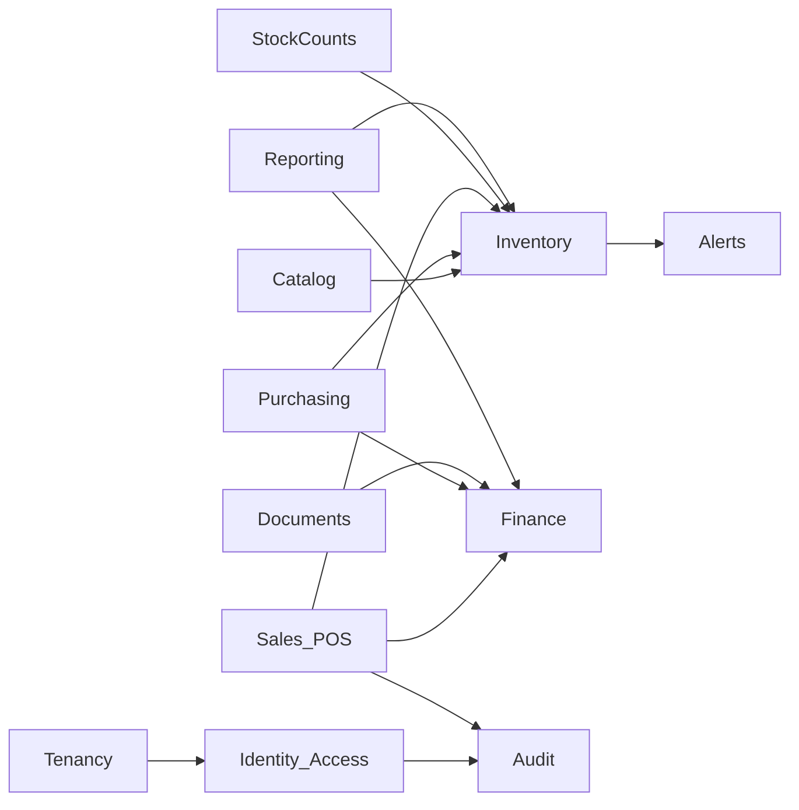
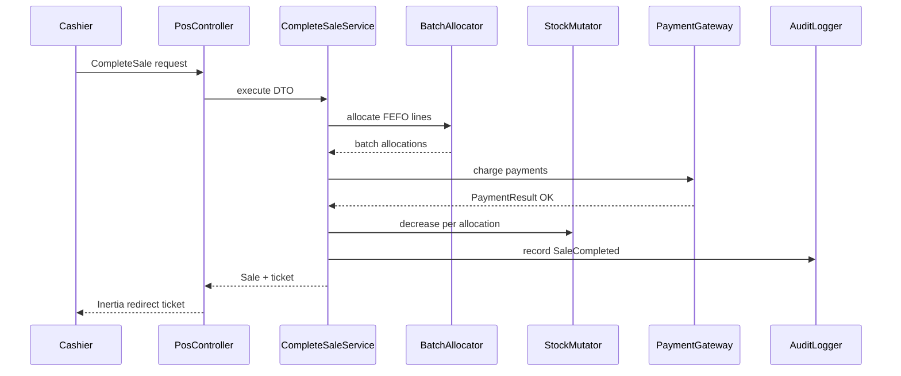
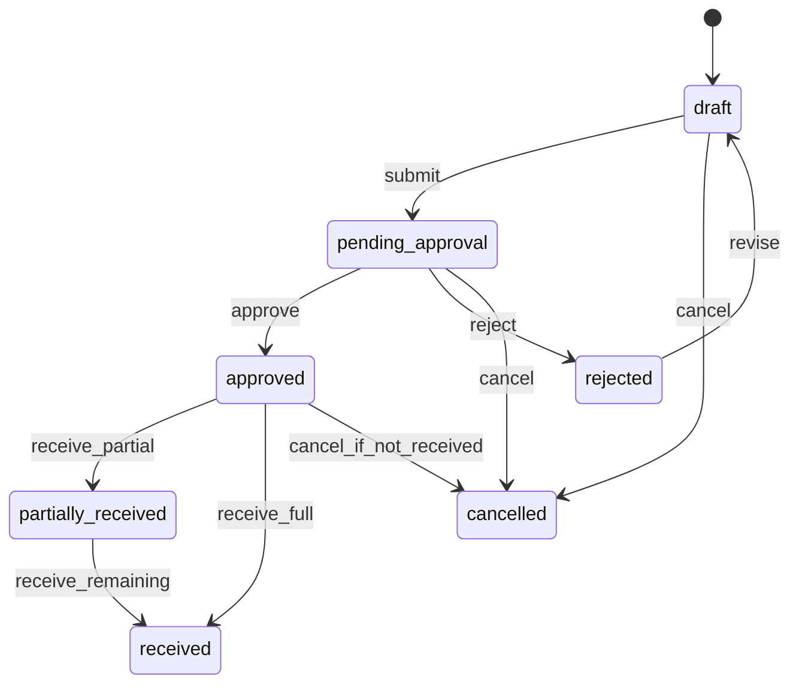
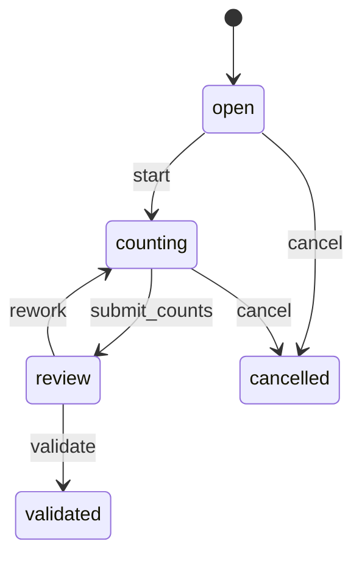
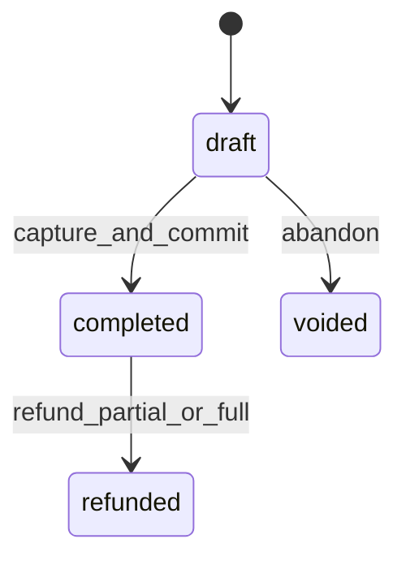
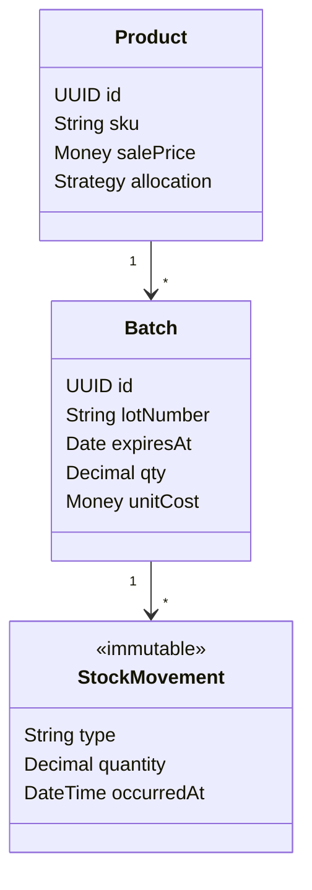

# 08 — Diagrammes UML

## 1. Context map

## 2. Séquence — Vente POS

## 3. États — Bon de commande

## 4. États — Inventaire physique

## 5. États — Vente

## 6. Classes — Inventory (simplifié)

